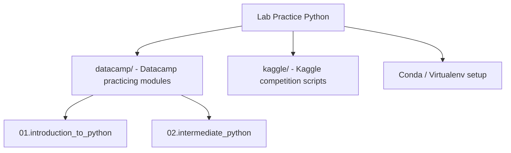

# Lab Practice Python

[](https://www.python.org/)
[](https://www.anaconda.com/)

## Table of Contents

- [Context](#-context)
- [Software features](#-software-features)
- [Technologies and tools](#-technologies-and-tools)
- [Architecture](#-architecture)
- [Repository structure](#-repository-structure)
- [Requirements](#-requirements)
- [How to run](#-how-to-run)
- [Author](#-author)

# 📌 Context 

This is a personal repository dedicated to practicing and consolidating Python programming skills through courses and platforms such as Datacamp and Kaggle. It covers foundational concepts, data manipulation, intermediate programming techniques, and algorithm implementations.

## 🚀 Software features

- **Datacamp Exercises (`datacamp/`):** Sequential modules focusing on core Python concepts (introduction, variables, lists, dictionaries, control flows) and intermediate programming.
- **Kaggle Sandbox (`kaggle/`):** A template directory set up to structure future scripts, notebooks, and models for Kaggle competitions.
- **Isolate Environments:** Supports Conda (`environment.yml`) and virtualenvs (`requirements.txt`) for consistent package management.

## 🛠️ Technologies and tools

- Python 3.10
- Anaconda / Conda (Environment management)
- Python Packages (Numpy, Pandas, Matplotlib, Jupyter, etc.)

## 📋 Architecture



## 📂 Repository structure

```text
- 📂 lab-practice-python/
  - 📄 environment.yml (Conda dependency configuration)
  - 📂 datacamp/
    - 📄 requirements.txt (Dependencies file for Datacamp)
    - 📂 01.introduction_to_python/ (Introductory scripts)
    - 📂 02.intermediate_python/ (Intermediate scripts)
  - 📂 kaggle/ (Kaggle scripts and datasets container)
```

## 📦 Requirements

- Python 3.10+ or Anaconda/Miniconda installed

## ⚙️ How to run

### 1. Clone the Repository
Clone the repository to your local machine:
```bash
git clone https://github.com/MatheusRodri/lab-practice-python.git
cd lab-practice-python
```

### 2. Environment Setup
Choose one of the following methods to prepare your workspace:

#### Method A: Using Conda (Recommended)
Create and activate the environment from the root directory:
```bash
conda env create -f environment.yml
conda activate practice_python
```

#### Method B: Using pip and virtualenv
Create and activate a virtual environment, then install requirements from the `datacamp` folder:

**On Windows (PowerShell):**
```powershell
python -m venv venv
.\venv\Scripts\Activate.ps1
pip install -r datacamp/requirements.txt
```

**On Linux/macOS:**
```bash
python3 -m venv venv
source venv/bin/activate
pip install -r datacamp/requirements.txt
```

### 3. Run Scripts
Navigate to any lesson module and execute Python files or open notebooks:
```bash
cd datacamp/01.introduction_to_python
python main.py
```
*(Replace `main.py` with whichever script you wish to run).*

## 👤 Author

Matheus Rodrigues 
[LinkedIn](https://linkedin.com/in/matheus-rodrigues-mrj) [GitHub](https://github.com/MatheusRodri)
